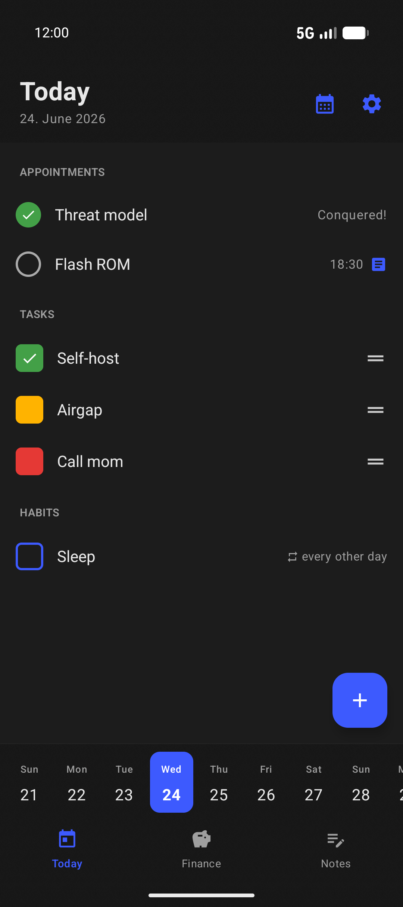
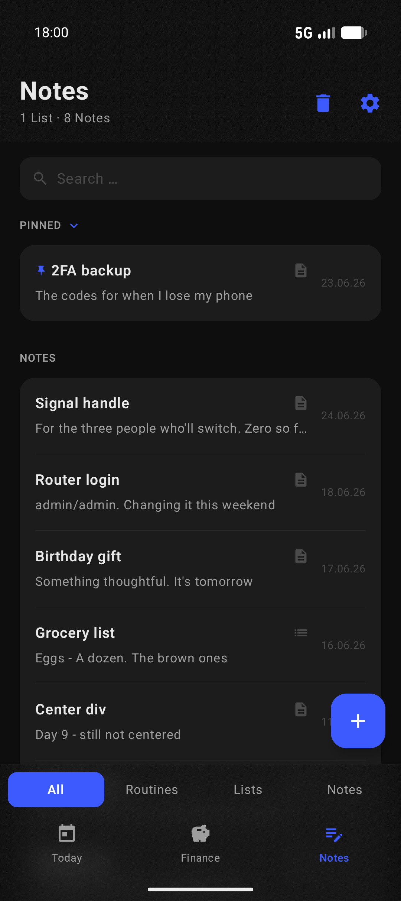
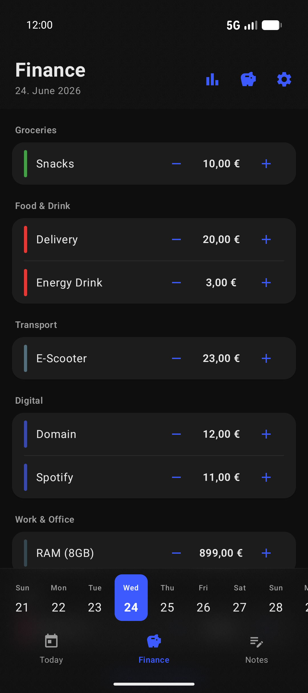
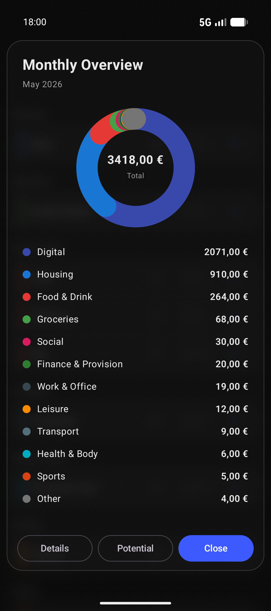

<div align="center">

# Mushotoku

**A private, fully-offline productivity app for focusing on what matters – and letting go of the rest.**

*No accounts · No cloud · No tracking · No ads · No internet permission.*

[](https://github.com/tomfrischmuth/mushotoku/releases)
[](#-license)
[](#requirements)
[](#-tech-stack)

</div>

---

## About

**Mushotoku** (無所得) is a Zen Buddhist term meaning *acting without grasping for a result* — without aim, without striving for gain.

Which makes it a slightly absurd name for a productivity app. That's the point.

Most productivity apps want you to optimize every minute, defend every streak, and turn your one short life into a backlog. Mushotoku goes the other way: work out the few things that actually matter today, do them, and then — the genuinely hard part — let the rest go. It's a tool for focusing, not for filling. The aim is fewer open tabs in your head, not more.

And then, ideally, you put the phone down. It's an app that's quietly rooting for you to use it less.

Everything you write, track, and plan stays **on your device**. Mushotoku ships with **no `INTERNET` permission at all**, so it physically cannot send your data anywhere — not because we promise not to, but because the option was never built.

---

## 🌱 What Mushotoku won't do

Some things are missing on purpose. Mushotoku will never:

- **Shame you over a broken streak.** Miss a day and… nothing happens. The habit is still there tomorrow.
- **Maximize "engagement."** There are no hooks engineered to pull you back in. Forget the app exists for a week and it has done its job perfectly.
- **Gamify your inner life.** No XP for journaling, no badges for breathing. Sitting quietly is its own reward — or so the Buddhists keep telling me.
- **Phone home.** It can't (see the permissions table) and wouldn't want to anyway.
- **Become a second job.** No productivity score, no infinite backlog, no dashboard quantifying how far "behind" you are.

---

## ✨ Features

### 🗓 Plan & organize
- **Calendar** — appointments and events, with an offline holiday layer
- **Tasks** — manage to-dos and stay on top of the day
- **Habits** — build and track recurring habits

### 📝 Capture & reflect
- **Notes** — Markdown editor with a formatting toolbar, a clean read view, and a trash with restore
- **Gratitude journal** — daily entries with a searchable archive
- **Mood tracking** — log how you feel over time

### 🧘 Wellbeing
- **Meditation timer** — sessions with three different bells and mindful Buddhist quotes
- **Sleep & caffeine** — see how much caffeine is still active at bedtime

### 💶 Money
- **Income & expenses** — across custom categories, including recurring costs
- **Savings potential** — a rolling-year estimate of how much you could set aside
- **Detailed Reports** — spending by category, with trends over time

### 🔒 Privacy & security
- **No internet access** — the app declares zero networking permissions
- **Encrypted at rest** — local database encrypted with **SQLCipher**
- **Strong key derivation** — passphrase protected via **Argon2**
- **App lock** — PIN and biometric unlock (fingerprint / face)
- **Encrypted backup & restore** — export and import your data locally
- **PDF export** — generate a journal PDF of your entries

### 🎨 Personalization
- Multiple selectable launcher icons
- Light/dark appearance and personalization options
- **9 languages**: English, German, Spanish, French, Italian, Portuguese (Portugal & Brazil), Dutch, Polish — English as fallback

---

## 📸 Screenshots

<table align="center">
  <tr>
    <td align="center"><br><sub>Calendar</sub></td>
    <td align="center"><br><sub>Notes</sub></td>
    <td align="center"><br><sub>Expenses</sub></td>
    <td align="center"><br><sub>Overview</sub></td>
  </tr>
</table>

---

## 📥 Download

Grab the latest signed APK from the [**Releases**](https://github.com/tomfrischmuth/mushotoku/releases) page.

### Requirements
- Android 13+ (minSdk **33**)

---

## ✅ Verification

Every release is signed with the project release key, and each artifact ships with a **SHA-256** checksum on the Releases page.

```sh
# Check your download against the published checksum
# (replace <apk-file> with the actual file name from the Releases page)
sha256sum -c <apk-file>.apk.sha256
```

The full source is public, so you don't have to trust the prebuilt APK: you can build the app yourself from the matching source tag (see below). Trust, but verify — preferably without taking my word for any of it.

---

## 🛠 Build from source

```sh
git clone https://github.com/tomfrischmuth/mushotoku.git
cd mushotoku
./gradlew :app:assembleRelease
```

Signing is configured via `keystore.properties` — copy the example and fill in your own keystore details:

```sh
cp keystore.properties.example keystore.properties
```

For a debug build:

```sh
./gradlew :app:assembleDebug
```

---

## 🧱 Tech stack

- **Language:** Kotlin
- **UI:** Jetpack Compose / Material 3
- **Persistence:** Room over SQLCipher
- **Crypto:** Android Keystore, AndroidX Biometric, Argon2kt
- **Serialization:** kotlinx.serialization
- **Min SDK:** 33 (Android 13) · **Target SDK:** 37

---

## 🔐 Privacy at a glance

| | |
|---|---|
| Network access | **None** — no `INTERNET` permission |
| Accounts | Not required |
| Analytics / telemetry | None |
| Third-party trackers | None |
| Ads | None |
| Data storage | On-device only, encrypted |

Declared permissions are limited to local functionality — deliberately boring: `FOREGROUND_SERVICE` / `FOREGROUND_SERVICE_MEDIA_PLAYBACK` (meditation timer playback), `POST_NOTIFICATIONS`, `WAKE_LOCK`, `VIBRATE`, and `USE_EXACT_ALARM` (reminders). That's the whole list.

---

## 🔒 Security in detail

All sensitive data is encrypted locally. The app takes advantage of hardware
security (StrongBox / Secure Element) when present, but runs on any supported
Android device — when such hardware is unavailable it transparently falls back
to a software-backed implementation.

### Encryption

- **Database** — the entire SQLite database is encrypted with
  **SQLCipher (AES-256)**. The database encryption key (DEK) is a random
  256-bit key.

- **Three protection modes (`KeyMode`)** — the DEK is wrapped differently
  depending on the chosen mode:
  - `KEYSTORE_NO_LOCK` — DEK wrapped by an AES-256 key in the Android Keystore;
    no user interaction required.
  - `KEYSTORE_LOCK` — DEK protected by an RSA-2048 key (OAEP/SHA-256) in the
    Keystore that requires **biometric authentication or device PIN**.
  - `PASSPHRASE` — DEK wrapped by a key derived from the user's passphrase
    (see Argon2 below).

- **Key derivation** — passphrases are processed with **Argon2id**
  (64 MB memory, 3 iterations), hardening against brute-force attacks.

- **Hardware-backed key storage** — Keystore keys are generated in
  **StrongBox** (e.g. the Titan M chip on Pixel devices) when available. If the
  chip is missing, the app automatically falls back via
  `StrongBoxUnavailableException` to the software-/TEE-backed Keystore.

- **Biometrics** — unlock via `BiometricPrompt` (`BIOMETRIC_STRONG`), with
  device PIN/pattern as a fallback (`DEVICE_CREDENTIAL`).

- **Encrypted backups** — export/import as **AES-256-GCM** with an
  Argon2id-derived key and a built-in 128-bit authentication tag. Content is
  gzip-compressed before encryption.

- **App lock** — configurable inactivity/background timeout that re-locks the
  app.

- **Screenshot protection** — optional `FLAG_SECURE` blocks screenshots and
  screen recording.

- **Memory hygiene** — passphrases and keys are wiped from memory immediately
  after use (`wipe()`).

> **Note:** The only difference between a device with and without a hardware
> security chip is *where the key is stored*. On a Pixel (or other StrongBox
> device) keys live in the dedicated security chip, giving stronger protection
> against physical attacks; on devices without it the keys are software-/TEE-
> backed. All security features themselves work on every supported device.

---

## 📦 Open source

Mushotoku is free and open-source software. Bundled third-party libraries and their licenses are viewable in-app under *Settings → Licenses*.

---

## 📄 License

Mushotoku is licensed under the **GNU General Public License v3.0**.

You are free to use, study, share, and modify the software. Any distributed derivative work must remain open-source under the same license. See the [`LICENSE`](LICENSE) file for the full text.

```
Copyright (C) 2026 Tom Frischmuth

This program is free software: you can redistribute it and/or modify
it under the terms of the GNU General Public License as published by
the Free Software Foundation, either version 3 of the License, or
(at your option) any later version.

This program is distributed in the hope that it will be useful,
but WITHOUT ANY WARRANTY; without even the implied warranty of
MERCHANTABILITY or FITNESS FOR A PARTICULAR PURPOSE.  See the
GNU General Public License for more details.
```

---

## 🤝 Contributing

Issues and pull requests are welcome. Please open an issue to discuss larger changes before submitting a PR — partly good etiquette, partly so neither of us spends a weekend on something the other was about to delete.

---

<div align="center">
<sub>Made with care. Collects nothing. Quietly hopes you'll use it less. 🪷</sub>
</div>
